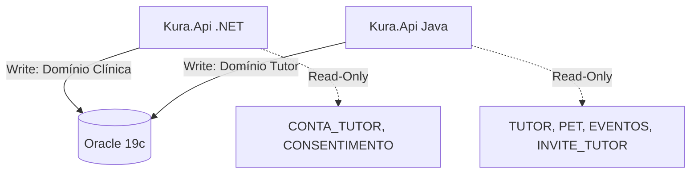

```markdown
# KURA — Banco de Dados

Repositório central de modelagem, scripts DDL (Data Definition Language) e versionamento do banco de dados relacional do sistema de gestão veterinária **Clyvo Vet** (KURA). Desenvolvido como parte do Challenge FIAP 2026.

## Stack

| Tecnologia | Versão | Finalidade |
|---|---|---|
| Oracle Database | 19c / 21c | SGBD Relacional principal |
| Flyway | 10.x | Versionamento de schema e migrations |
| SQL Developer Data Modeler | — | Modelagem lógica (Notação Barker) |
| PlantUML | — | Geração de diagramas de classes e DER |

## Arquitetura e Ownership

O banco opera no padrão **Shared Database**, servindo a dois backends simultaneamente com regras estritas de *ownership* (propriedade de escrita) para evitar acoplamento nocivo e concorrência descontrolada.



| Domínio | Responsabilidade | Ownership (Escrita) |
| --- | --- | --- |
| **Clínica (.NET)** | Operação base, prontuário, IoT e convites | `CLINICA`, `VETERINARIO`, `TUTOR`, `PET`, `EVENTO_CLINICO`, `DISPOSITIVO_IOT`, `INVITE_TUTOR` |
| **Tutor (Java)** | Identidade, agendamento e compliance LGPD | `CONTA_TUTOR`, `CONSENTIMENTO`, `AGENDAMENTO`*, `IDEMPOTENCY_KEY` |
| **Compartilhado** | Auditoria e relatórios agregados | `LOG_ERRO`, `VW_TIMELINE_PET`, `VW_VACINAS_VENCENDO` |

**A tabela `AGENDAMENTO` utiliza Optimistic Locking (`NR_VERSION`) para permitir fluxos seguros de atualização cruzada.*

## Conexão com o Banco (Ambiente FIAP)

A infraestrutura do banco de dados é fornecida pela FIAP. **Não utilizamos containers Docker locais para o Oracle.**

Para conectar via IDE (DBeaver, DataGrip, SQL Developer), utilize as credenciais do squad:

| Parâmetro | Valor |
| --- | --- |
| **Host** | `oracle.fiap.com.br` |
| **Porta** | `1521` |
| **SID / Service** | `ORCL` |
| **User** | `RMXXXXX` *(credencial do squad)* |
| **Password** | `<senha-fornecida>` |

## Estrutura de Diretórios

```text
.
├── docs/
│   ├── modelagem/          # Arquivo nativo .dmd (Data Modeler)
│   ├── diagrams/           # DER e Diagramas de Classe em .puml e .png
│   └── data-dictionary.md  # Dicionário de dados atualizado
├── src/
│   └── migrations/         # Scripts SQL (Flyway)
│       └── V1__initial_schema.sql
└── README.md

```

## Como aplicar as Migrations (Flyway)

A execução dos scripts DDL é totalmente automatizada via Flyway, acoplada à inicialização dos backends.

Se precisar rodar manualmente via CLI do Flyway para testes:

```bash
flyway -url="jdbc:oracle:thin:@oracle.fiap.com.br:1521:ORCL" \
       -user="RMXXXXX" \
       -password="<senha>" \
       -locations="filesystem:src/migrations" \
       migrate

```

## Regras de Versionamento (DDL)

1. **Nunca utilize `ALTER TABLE` em scripts antigos:** O Flyway falha se o checksum de um script já aplicado for modificado.
2. **Novas alterações:** Crie arquivos sequenciais exatos: `V2__add_tabela_nova.sql`, `V3__altera_coluna.sql`.
3. **Nomenclatura Padrão:**
* PKs / FKs: prefixo `ID_`
* Strings / Textos: prefixo `DS_` ou `NM_`
* Datas / Timestamps: prefixo `DT_`
* Booleanos / Status: prefixo `ST_`


4. **Constraints obrigatórias:** Toda constraint deve ser explicitamente nomeada (`PK_`, `FK_`, `UK_`, `CK_`).
5. **Comentários:** Utilize `COMMENT ON TABLE` e `COMMENT ON COLUMN` no DDL para documentação em tempo real no SGBD.

## Estrutura das Principais Tabelas

### Autenticação e Onboarding

| Tabela | Descrição |
| --- | --- |
| `INVITE_TUTOR` | Convites seguros gerados pela clínica (.NET) para cadastro do tutor. |
| `CONTA_TUTOR` | Credenciais de acesso (Java). Possui vínculo único com o `INVITE_TUTOR` (anti-reuso). |
| `CONSENTIMENTO` | Histórico imutável de aceites da LGPD. |

### Núcleo Clínico

| Tabela | Descrição |
| --- | --- |
| `TUTOR` / `PET` | Dados cadastrais. Relacionamento N:N via `TUTOR_PET`. |
| `EVENTO_CLINICO` | Linha do tempo de atendimentos. Agrega `VACINA`, `PRESCRICAO`, `EXAME`. |
| `AGENDAMENTO` | Intenções de atendimento com controle de concorrência (`NR_VERSION`). |

### Infraestrutura e IoT

| Tabela | Descrição |
| --- | --- |
| `DISPOSITIVO_IOT` | Catálogo de sensores (ex: termômetros de geladeira de vacinas). |
| `LEITURA_TEMPERATURA` | Time-series de dados de temperatura ingeridos via API .NET. |
| `IDEMPOTENCY_KEY` | Tabela auxiliar para evitar duplicidade em requisições sensíveis. |

## Equipe — Clyvo Vet

| Membro | Função |
| --- | --- |
| **Felipe Ferrete** *(líder técnico)* | .NET · IoT/IA |
| **Nikolas Brisola** | Java · Backend Tutor |
| **Guilherme Sola** | Mobile Tutor · UX |
| **Gustavo Bosak** | Mobile Clínica · QA |
| **Clayton** | DevOps · BD |

```

```